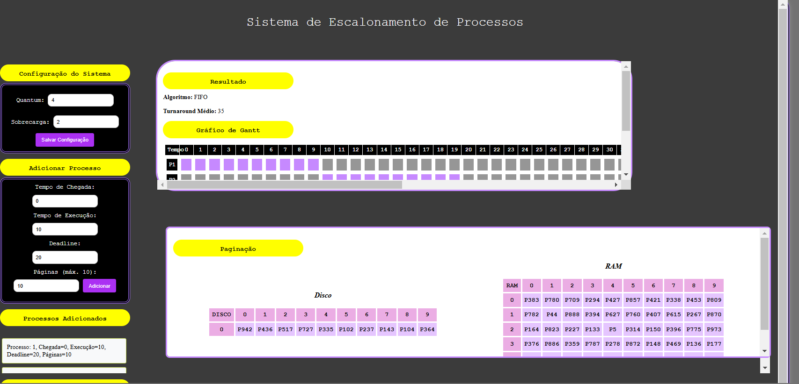

# Sistema de Escalonamento de Processos e Substituição de Páginas
[Acesse diretamente aqui:](https://sistema-escalonamento-so-2024-2.onrender.com/)

Este projeto implementa um sistema de escalonamento de processos que suporta múltiplos algoritmos de escalonamento e substituição de páginas. O sistema é desenvolvido em Python com uma interface web usando Flask.

*Para melhor responsividade, os elementos extensos e com tamanhos variáveis possuem scroll para sua visualização completa.*


## Funcionalidades

### FASE 1: Escalonamento de Processos

**Para adicionar novos processos após a execução de um dos algoritmos, é necessário reiniciar a execução com python app.py**
**Para rodar um algoritmo novamente após outro ser rodado(ex: FIFO>>RR>>FIFO), aconselhamos que a execução seja reiniciada com python app.py**

O sistema implementa os seguintes algoritmos de escalonamento de processos:

1. **FIFO (First-In, First-Out)**:
   - Executa os processos na ordem de chegada.
   - Não é preemptivo.

2. **SJF (Shortest Job First)**:
   - Executa o processo com o menor tempo de execução primeiro.
   - Ordena os processos por tempo de chegada e, em seguida, por tempo de execução para evitar starvation.

3. **Round Robin**:
   - Algoritmo preemptivo que atribui um tempo fixo (quantum) para cada processo.
   - Se um processo não terminar dentro do quantum, ele é suspenso e colocado no final da fila de prontos.

4. **EDF (Earliest Deadline First)**:
   - Executa o processo com o prazo mais próximo primeiro.
   - Adequado para sistemas de tempo real.

### FASE 2: Substituição de Páginas

O sistema também implementa algoritmos de substituição de páginas para gerenciamento de memória:

1. **FIFO (First-In, First-Out)**:
   - Substitui a página que está na memória há mais tempo.

2. **LRU (Least Recently Used)**:
   - Substitui a página que não foi usada há mais tempo.

### Funcionalidades Adicionais

- **Gráfico de Gantt**: Visualização da execução dos processos ao longo do tempo.
- **Gráfico de Uso de Memória**: Mostra as páginas presentes na RAM e no disco em tempo real.
- **Turnaround Médio**: Calcula o tempo médio de turnaround (tempo de espera + tempo de execução) para os processos.

---

## Requisitos

- Python 3.x
- Flask (para a interface web)
- Bibliotecas adicionais (se necessário): `matplotlib` para gráficos.

---

## Como Usar

### Instalação

1. Clone o repositório:
   ```bash
   git clone https://github.com/seu-usuario/seu-repositorio.git
   cd seu-repositorio

2. Instale as dependências:
   ```bash
   pip install flask

### Executando o Sistema

1. Inicie o servidor Flask:
    ```bash
    python app.py

2. Acesse a aplicação no navegador:
    ```bash
    http://127.0.0.1:5000/


## Interface Web

### Configuração do Sistema

1. Na interface web, insira os dados do sistema:

    - **Quantum**: Tempo máximo que um processo pode executar antes de ser interrompido (para Round Robin).

    - **Sobrecarga**: Tempo necessário para alternar entre processos.

2. Clique em "Salvar Configuração" para definir os parâmetros do sistema.


### Adicionar Processos

1. Insira os dados do processo:

    - **Tempo de Chegada**: Momento em que o processo chega ao sistema.

    - **Tempo de Execução**: Tempo necessário para o processo ser concluído.

    - **Deadline**: Prazo máximo para conclusão do processo.

    - **Páginas por Processo**: Número de páginas de memória que o processo utiliza (máximo de 10).

2. Clique em "Adicionar" para incluir o processo na lista.


### Executar Escalonador

1. Selecione o algoritmo de escalonamento desejado (FIFO, SJF, Round Robin, EDF).

2. Clique em "Executar" para ver o resultado.

### Substituição de Páginas

1. Selecione o algoritmo de substituição de páginas (FIFO ou LRU).

2. Clique em "Iniciar Simulação" para ver o resultado da paginação.

## Visualizações

### Gráfico de Gantt
- Mostra a execução dos processos ao longo do tempo.
- Cores:
   - **Lilás**: Processo em execução.
   - **Vermelho**: Processo executado após o deadline.
   - **Amarelo**: Processo em espera.
   - **Rosa**: Sobrecarga do sistema.
   - **Cinza**: Processo ainda não chegou ou não está na fila.

### Tabelas de Memória
- **RAM**: Exibe as páginas atualmente na memória.
- **Disco**: Exibe as páginas atualmente no disco.

## Estrutura do Código

### Backend (Flask)
- **Rotas**:
   - `/set_config`: Define o quantum e a sobrecarga do sistema.
   - `/add_process`: Adiciona um novo processo à lista.
   - `/run_scheduler`: Executa o algoritmo de escalonamento selecionado.
   - `/paginacao`: Executa o algoritmo de substituição de páginas selecionado.

- **Funções**:
   - `gerar_paginas_aleatorias`: Gera páginas de memória aleatórias para cada processo.
   - `generate_gantt_chart`: Gera o gráfico de Gantt para visualização.

### Frontend (HTML/JavaScript)   
- **Formulários**: 
   - Configurações do sistema.
   - Adição de processos.
   - Escolha do algoritmo de escalonamento e substituição de página.
- **Gráficos**: 
   - Gráfico de Gantt.
   - Tabelas de meméria (RAM e Disco).
  
## Exemplo de uso 
1. Configure o sistema com um quantum de 5 e sobrecarga de 1.
2. Adicione processos com diferentes tempos de chegada, execução e deadlines.
3. Execute o escalonador com o algoritmo Round Robin.
4. Visualize o gráfico de Gantt e as tabelas de memória.
5. Execute a simulação de substituição de páginas com o algoritmo FIFO ou LRU.

## Colaboradoras:
- Laura Ferreira de Almeida **github**:https://github.com/laura-ferreira22
- Nalanda Santana Pita **github**:https://github.com/nalandap


